了解しました。以下は、**英語 UI のみを使った `README.md` のセクション構成例**です。あなたが指定した `Screenshot_20250730_*.png` の中から英語 UI に該当する画像を時系列で分類し、アプリの UI フローを整理しています。

---

## 📱 Survey App – English UI Flow

This app is a multilingual offline survey application designed for clarity and ease of use. Below is a step-by-step walkthrough of the **English interface**, showing the complete user journey.

---

### 🟢 1. Welcome Screen

The user is greeted with a welcome message and options to start the survey or resume from where they left off.

| Screenshot                            |
| ------------------------------------- |
|  |
---

### 📋 2. Survey Questions

Each screen presents one question at a time. Users can navigate through Yes/No and single/multiple-choice questions.

| Screenshot                            |
| ------------------------------------- |
| 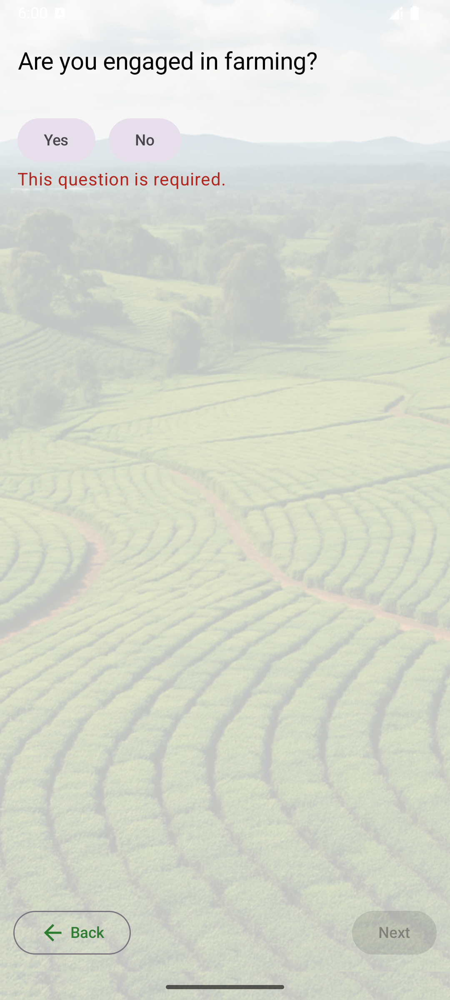 |
| 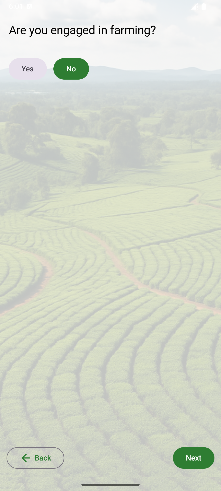 |
| 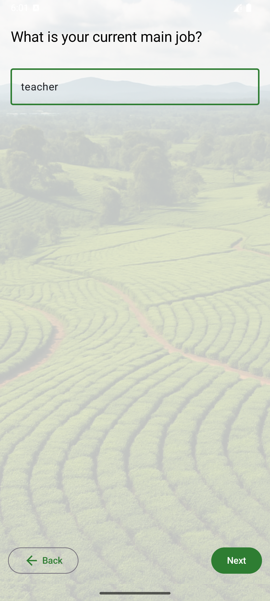 |
| 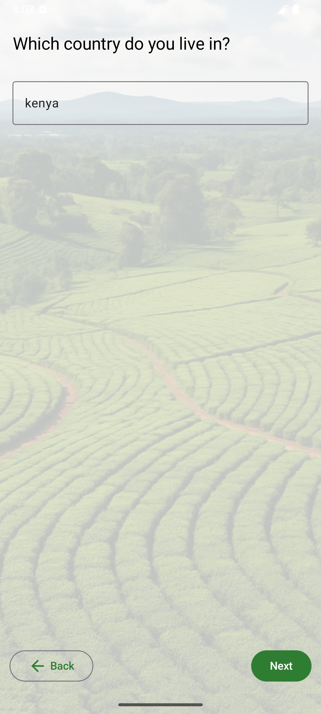 |

---

| Screenshot                            |
| ------------------------------------- |
| 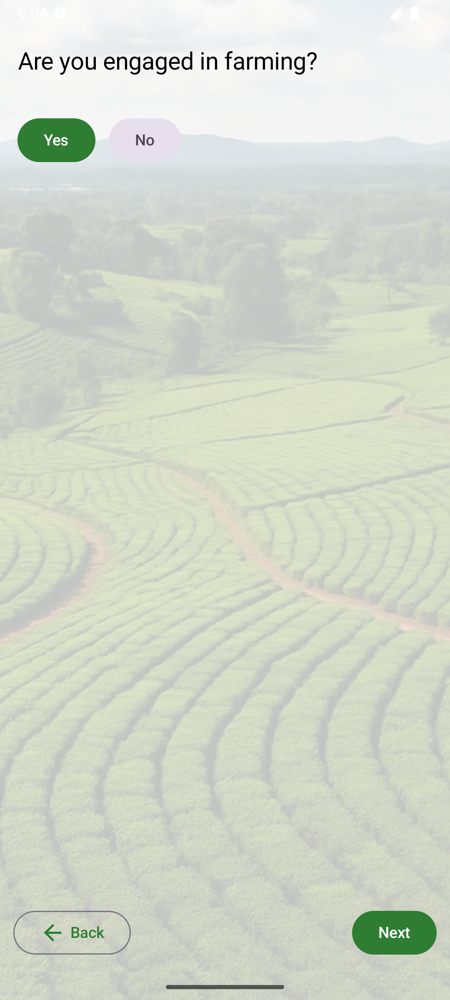 |
| 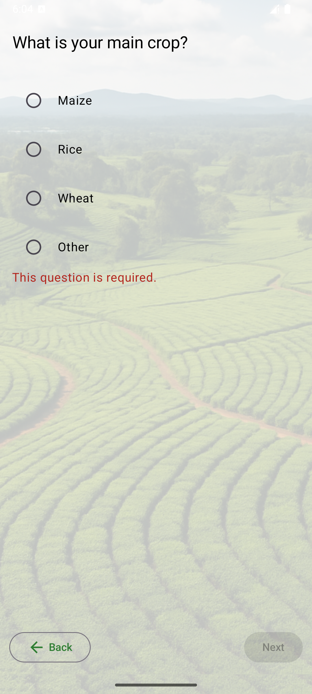 |
| 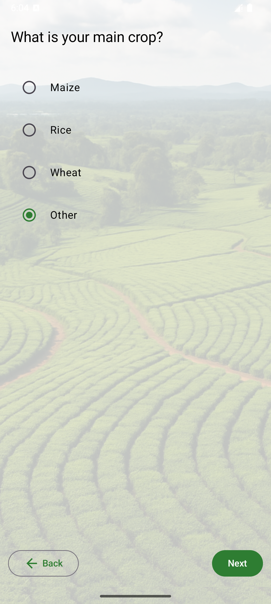 |
| 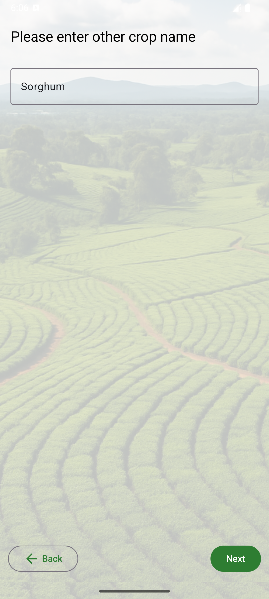 |
| 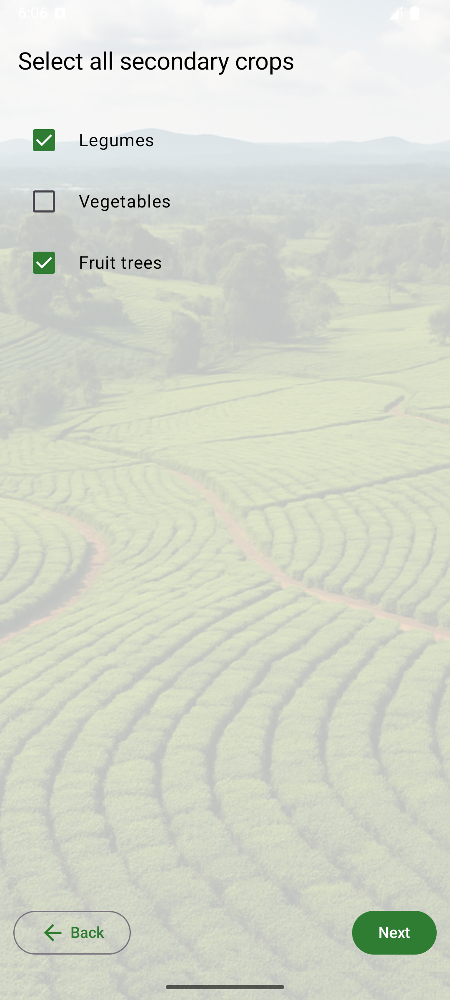 |
| 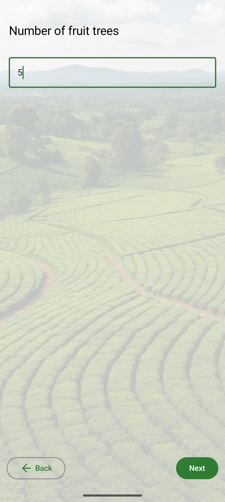 |
| 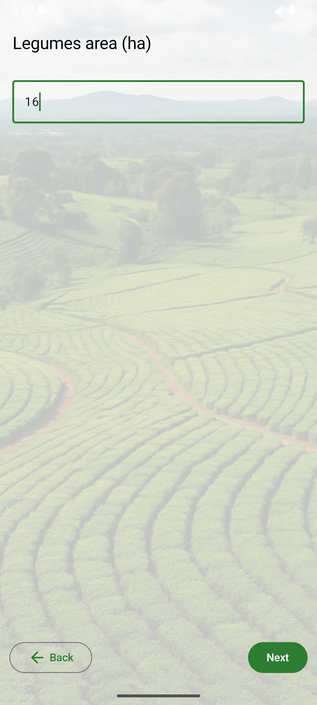 |

---

### 📑 3. Summary Page

After answering all questions, users see a summary of their responses. They can review and confirm before submitting.

| Screenshot                            |
| ------------------------------------- |
| 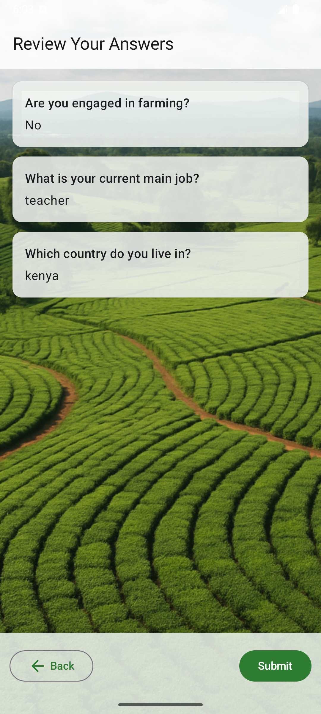 |

---

| Screenshot                            |
| ------------------------------------- |
|  |

---

### 🎉 4. Thank You Screen

After submission, a confirmation page thanks the user for completing the survey.

| Screenshot                            |
| ------------------------------------- |
|  |

---

## 🛠️ Tech Notes

* Built with **Jetpack Compose**, using `ViewModel` and `StateFlow` for state management.
* Language switching is powered by `AppCompatDelegate.setApplicationLocales(...)` with automatic restarts.
* All screenshots captured using the Android Emulator.
